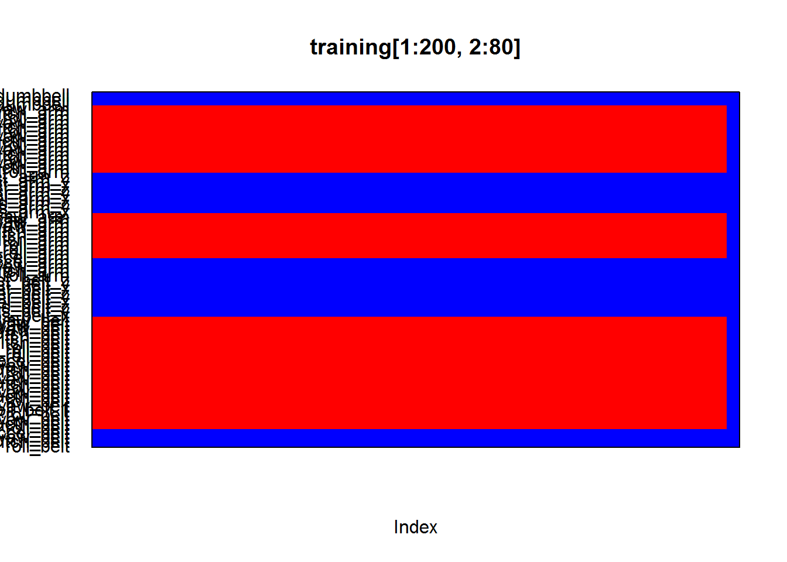
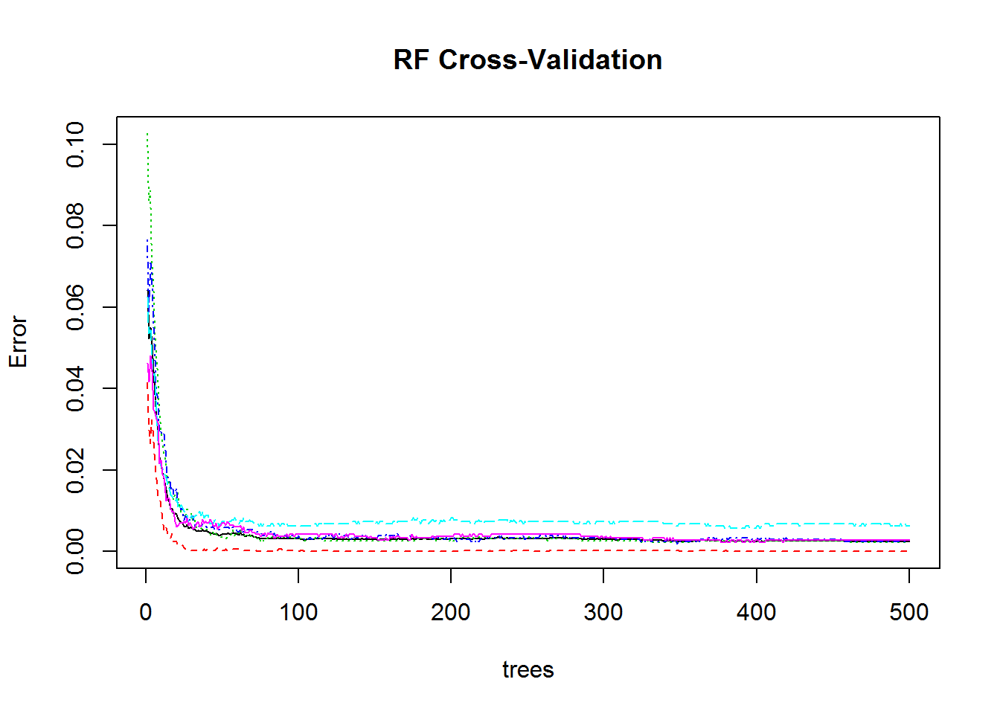
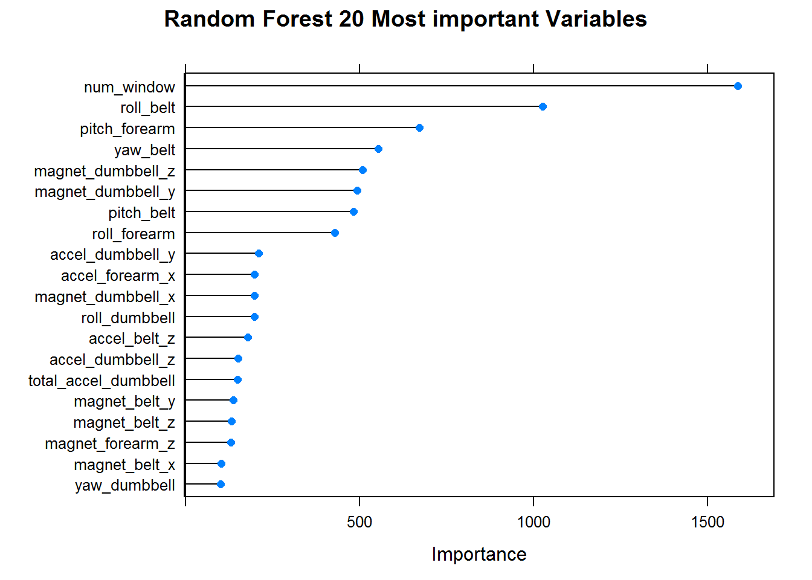

## 1. Dataset

Source: [Human Activity Recognition (PUC-RIO)](http://groupware.les.inf.puc-rio.br/har)

[Training](http://d396qusza40orc.cloudfront.net/predmachlearn/pml-training.csv)

[Testing](http://d396qusza40orc.cloudfront.net/predmachlearn/pml-testing.csv) (evaluated by Coursera System, we dont have labels of these results)

## 2. Objectives
Predict the manner in which a group of enthusiasts who take measurements about themselves did the exercise. This is the "classe" variable in the training set. You may use any of the other variables to predict with. You should create a report describing how you built your model, how you used cross validation, what you think the expected out of sample error is, and why you made the choices you did. 

You will also use your prediction model to predict 20 different test cases ([Testing](http://d396qusza40orc.cloudfront.net/predmachlearn/pml-testing.csv)). For this reason, [Training](http://d396qusza40orc.cloudfront.net/predmachlearn/pml-training.csv) will be splited to build the present Machine Learning Model in this report.

## 3. Data Processing
### 3.1. Loading or installing the required packages
In this report are used r packages:

- **mi** (to plot missing values with respect of dataset)
- **caret** (to build machine learning model)

With the following code, packages required will be loaded or installed in case you do not have them:


```r
packages = c("mi","caret")  # Here, add your required packages
ipak <- function(pkg){                                          
  new.pkg <- pkg[!(pkg %in% installed.packages()[, "Package"])] 
  if (length(new.pkg))                                          
    install.packages(new.pkg, dependencies = TRUE)              
  sapply(pkg, require, character.only = TRUE)                   
}

ipak(packages)
```

```
##    mi caret 
##  TRUE  TRUE
```

### 3.2. Reading datasets


```r
file_training = "pml-training.csv"
file_testing = "pml-testing.csv"

training = read.csv(file_training, sep=",", header = TRUE, na.strings= c("NA",""," "), nrow=19622)
testing = read.csv(file_testing, sep=",", header = TRUE, na.strings= c("NA",""," "), nrow=20)

dim(training)
```

```
## [1] 19622   160
```

```r
dim(testing)
```

```
## [1]  20 160
```

### 3.2. Cleaning datasets

In the first instance, are removed attributes related to: timestam, X, usern_name, new_window:


```r
removeIndex = grep("timestamp|X|user_name|new_window",names(training));
training = training[,-removeIndex];
testing = testing[,-removeIndex];
```

To have a general overview about the dataset, we can take a look of missing values which are represented in red color, The folling picture (which is rotated) is a part of the dataset. Summary of the dataset is need complement the picture.


```r
missing.pattern.plot(training[1:200,2:80], ylab = "")
```



```r
summary(training)
```

```
##    num_window      roll_belt        pitch_belt          yaw_belt      
##  Min.   :  1.0   Min.   :-28.90   Min.   :-55.8000   Min.   :-180.00  
##  1st Qu.:222.0   1st Qu.:  1.10   1st Qu.:  1.7600   1st Qu.: -88.30  
##  Median :424.0   Median :113.00   Median :  5.2800   Median : -13.00  
##  Mean   :430.6   Mean   : 64.41   Mean   :  0.3053   Mean   : -11.21  
##  3rd Qu.:644.0   3rd Qu.:123.00   3rd Qu.: 14.9000   3rd Qu.:  12.90  
##  Max.   :864.0   Max.   :162.00   Max.   : 60.3000   Max.   : 179.00  
##                                                                       
##  total_accel_belt kurtosis_roll_belt kurtosis_picth_belt kurtosis_yaw_belt
##  Min.   : 0.00    #DIV/0!  :   10    #DIV/0!  :   32     #DIV/0!:  406    
##  1st Qu.: 3.00    -1.908453:    2    47.000000:    4     NA's   :19216    
##  Median :17.00    -0.016850:    1    -0.150950:    3                      
##  Mean   :11.31    -0.021024:    1    -0.684748:    3                      
##  3rd Qu.:18.00    -0.025513:    1    -1.750749:    3                      
##  Max.   :29.00    (Other)  :  391    (Other)  :  361                      
##                   NA's     :19216    NA's     :19216                      
##  skewness_roll_belt skewness_roll_belt.1 skewness_yaw_belt
##  #DIV/0!  :    9    #DIV/0!  :   32      #DIV/0!:  406    
##  0.000000 :    4    0.000000 :    4      NA's   :19216    
##  0.422463 :    2    -2.156553:    3                       
##  -0.003095:    1    -3.072669:    3                       
##  -0.010002:    1    -6.324555:    3                       
##  (Other)  :  389    (Other)  :  361                       
##  NA's     :19216    NA's     :19216                       
##  max_roll_belt     max_picth_belt   max_yaw_belt   min_roll_belt    
##  Min.   :-94.300   Min.   : 3.00   -1.1   :   30   Min.   :-180.00  
##  1st Qu.:-88.000   1st Qu.: 5.00   -1.4   :   29   1st Qu.: -88.40  
##  Median : -5.100   Median :18.00   -1.2   :   26   Median :  -7.85  
##  Mean   : -6.667   Mean   :12.92   -0.9   :   24   Mean   : -10.44  
##  3rd Qu.: 18.500   3rd Qu.:19.00   -1.3   :   22   3rd Qu.:   9.05  
##  Max.   :180.000   Max.   :30.00   (Other):  275   Max.   : 173.00  
##  NA's   :19216     NA's   :19216   NA's   :19216   NA's   :19216    
##  min_pitch_belt   min_yaw_belt   amplitude_roll_belt amplitude_pitch_belt
##  Min.   : 0.00   -1.1   :   30   Min.   :  0.000     Min.   : 0.000      
##  1st Qu.: 3.00   -1.4   :   29   1st Qu.:  0.300     1st Qu.: 1.000      
##  Median :16.00   -1.2   :   26   Median :  1.000     Median : 1.000      
##  Mean   :10.76   -0.9   :   24   Mean   :  3.769     Mean   : 2.167      
##  3rd Qu.:17.00   -1.3   :   22   3rd Qu.:  2.083     3rd Qu.: 2.000      
##  Max.   :23.00   (Other):  275   Max.   :360.000     Max.   :12.000      
##  NA's   :19216   NA's   :19216   NA's   :19216       NA's   :19216       
##  amplitude_yaw_belt var_total_accel_belt avg_roll_belt    stddev_roll_belt
##  #DIV/0!:   10      Min.   : 0.000       Min.   :-27.40   Min.   : 0.000  
##  0.00   :   12      1st Qu.: 0.100       1st Qu.:  1.10   1st Qu.: 0.200  
##  0.0000 :  384      Median : 0.200       Median :116.35   Median : 0.400  
##  NA's   :19216      Mean   : 0.926       Mean   : 68.06   Mean   : 1.337  
##                     3rd Qu.: 0.300       3rd Qu.:123.38   3rd Qu.: 0.700  
##                     Max.   :16.500       Max.   :157.40   Max.   :14.200  
##                     NA's   :19216        NA's   :19216    NA's   :19216   
##  var_roll_belt     avg_pitch_belt    stddev_pitch_belt var_pitch_belt  
##  Min.   :  0.000   Min.   :-51.400   Min.   :0.000     Min.   : 0.000  
##  1st Qu.:  0.000   1st Qu.:  2.025   1st Qu.:0.200     1st Qu.: 0.000  
##  Median :  0.100   Median :  5.200   Median :0.400     Median : 0.100  
##  Mean   :  7.699   Mean   :  0.520   Mean   :0.603     Mean   : 0.766  
##  3rd Qu.:  0.500   3rd Qu.: 15.775   3rd Qu.:0.700     3rd Qu.: 0.500  
##  Max.   :200.700   Max.   : 59.700   Max.   :4.000     Max.   :16.200  
##  NA's   :19216     NA's   :19216     NA's   :19216     NA's   :19216   
##   avg_yaw_belt      stddev_yaw_belt    var_yaw_belt      
##  Min.   :-138.300   Min.   :  0.000   Min.   :    0.000  
##  1st Qu.: -88.175   1st Qu.:  0.100   1st Qu.:    0.010  
##  Median :  -6.550   Median :  0.300   Median :    0.090  
##  Mean   :  -8.831   Mean   :  1.341   Mean   :  107.487  
##  3rd Qu.:  14.125   3rd Qu.:  0.700   3rd Qu.:    0.475  
##  Max.   : 173.500   Max.   :176.600   Max.   :31183.240  
##  NA's   :19216      NA's   :19216     NA's   :19216      
##   gyros_belt_x        gyros_belt_y       gyros_belt_z    
##  Min.   :-1.040000   Min.   :-0.64000   Min.   :-1.4600  
##  1st Qu.:-0.030000   1st Qu.: 0.00000   1st Qu.:-0.2000  
##  Median : 0.030000   Median : 0.02000   Median :-0.1000  
##  Mean   :-0.005592   Mean   : 0.03959   Mean   :-0.1305  
##  3rd Qu.: 0.110000   3rd Qu.: 0.11000   3rd Qu.:-0.0200  
##  Max.   : 2.220000   Max.   : 0.64000   Max.   : 1.6200  
##                                                          
##   accel_belt_x       accel_belt_y     accel_belt_z     magnet_belt_x  
##  Min.   :-120.000   Min.   :-69.00   Min.   :-275.00   Min.   :-52.0  
##  1st Qu.: -21.000   1st Qu.:  3.00   1st Qu.:-162.00   1st Qu.:  9.0  
##  Median : -15.000   Median : 35.00   Median :-152.00   Median : 35.0  
##  Mean   :  -5.595   Mean   : 30.15   Mean   : -72.59   Mean   : 55.6  
##  3rd Qu.:  -5.000   3rd Qu.: 61.00   3rd Qu.:  27.00   3rd Qu.: 59.0  
##  Max.   :  85.000   Max.   :164.00   Max.   : 105.00   Max.   :485.0  
##                                                                       
##  magnet_belt_y   magnet_belt_z       roll_arm         pitch_arm      
##  Min.   :354.0   Min.   :-623.0   Min.   :-180.00   Min.   :-88.800  
##  1st Qu.:581.0   1st Qu.:-375.0   1st Qu.: -31.77   1st Qu.:-25.900  
##  Median :601.0   Median :-320.0   Median :   0.00   Median :  0.000  
##  Mean   :593.7   Mean   :-345.5   Mean   :  17.83   Mean   : -4.612  
##  3rd Qu.:610.0   3rd Qu.:-306.0   3rd Qu.:  77.30   3rd Qu.: 11.200  
##  Max.   :673.0   Max.   : 293.0   Max.   : 180.00   Max.   : 88.500  
##                                                                      
##     yaw_arm          total_accel_arm var_accel_arm     avg_roll_arm    
##  Min.   :-180.0000   Min.   : 1.00   Min.   :  0.00   Min.   :-166.67  
##  1st Qu.: -43.1000   1st Qu.:17.00   1st Qu.:  9.03   1st Qu.: -38.37  
##  Median :   0.0000   Median :27.00   Median : 40.61   Median :   0.00  
##  Mean   :  -0.6188   Mean   :25.51   Mean   : 53.23   Mean   :  12.68  
##  3rd Qu.:  45.8750   3rd Qu.:33.00   3rd Qu.: 75.62   3rd Qu.:  76.33  
##  Max.   : 180.0000   Max.   :66.00   Max.   :331.70   Max.   : 163.33  
##                                      NA's   :19216    NA's   :19216    
##  stddev_roll_arm    var_roll_arm       avg_pitch_arm     stddev_pitch_arm
##  Min.   :  0.000   Min.   :    0.000   Min.   :-81.773   Min.   : 0.000  
##  1st Qu.:  1.376   1st Qu.:    1.898   1st Qu.:-22.770   1st Qu.: 1.642  
##  Median :  5.702   Median :   32.517   Median :  0.000   Median : 8.133  
##  Mean   : 11.201   Mean   :  417.264   Mean   : -4.901   Mean   :10.383  
##  3rd Qu.: 14.921   3rd Qu.:  222.647   3rd Qu.:  8.277   3rd Qu.:16.327  
##  Max.   :161.964   Max.   :26232.208   Max.   : 75.659   Max.   :43.412  
##  NA's   :19216     NA's   :19216       NA's   :19216     NA's   :19216   
##  var_pitch_arm       avg_yaw_arm       stddev_yaw_arm   
##  Min.   :   0.000   Min.   :-173.440   Min.   :  0.000  
##  1st Qu.:   2.697   1st Qu.: -29.198   1st Qu.:  2.577  
##  Median :  66.146   Median :   0.000   Median : 16.682  
##  Mean   : 195.864   Mean   :   2.359   Mean   : 22.270  
##  3rd Qu.: 266.576   3rd Qu.:  38.185   3rd Qu.: 35.984  
##  Max.   :1884.565   Max.   : 152.000   Max.   :177.044  
##  NA's   :19216      NA's   :19216      NA's   :19216    
##   var_yaw_arm         gyros_arm_x        gyros_arm_y     
##  Min.   :    0.000   Min.   :-6.37000   Min.   :-3.4400  
##  1st Qu.:    6.642   1st Qu.:-1.33000   1st Qu.:-0.8000  
##  Median :  278.309   Median : 0.08000   Median :-0.2400  
##  Mean   : 1055.933   Mean   : 0.04277   Mean   :-0.2571  
##  3rd Qu.: 1294.850   3rd Qu.: 1.57000   3rd Qu.: 0.1400  
##  Max.   :31344.568   Max.   : 4.87000   Max.   : 2.8400  
##  NA's   :19216                                           
##   gyros_arm_z       accel_arm_x       accel_arm_y      accel_arm_z     
##  Min.   :-2.3300   Min.   :-404.00   Min.   :-318.0   Min.   :-636.00  
##  1st Qu.:-0.0700   1st Qu.:-242.00   1st Qu.: -54.0   1st Qu.:-143.00  
##  Median : 0.2300   Median : -44.00   Median :  14.0   Median : -47.00  
##  Mean   : 0.2695   Mean   : -60.24   Mean   :  32.6   Mean   : -71.25  
##  3rd Qu.: 0.7200   3rd Qu.:  84.00   3rd Qu.: 139.0   3rd Qu.:  23.00  
##  Max.   : 3.0200   Max.   : 437.00   Max.   : 308.0   Max.   : 292.00  
##                                                                        
##   magnet_arm_x     magnet_arm_y     magnet_arm_z    kurtosis_roll_arm
##  Min.   :-584.0   Min.   :-392.0   Min.   :-597.0   #DIV/0! :   78   
##  1st Qu.:-300.0   1st Qu.:  -9.0   1st Qu.: 131.2   -0.02438:    1   
##  Median : 289.0   Median : 202.0   Median : 444.0   -0.04190:    1   
##  Mean   : 191.7   Mean   : 156.6   Mean   : 306.5   -0.05051:    1   
##  3rd Qu.: 637.0   3rd Qu.: 323.0   3rd Qu.: 545.0   -0.05695:    1   
##  Max.   : 782.0   Max.   : 583.0   Max.   : 694.0   (Other) :  324   
##                                                     NA's    :19216   
##  kurtosis_picth_arm kurtosis_yaw_arm skewness_roll_arm skewness_pitch_arm
##  #DIV/0! :   80     #DIV/0! :   11   #DIV/0! :   77    #DIV/0! :   80    
##  -0.00484:    1     0.55844 :    2   -0.00051:    1    -0.00184:    1    
##  -0.01311:    1     0.65132 :    2   -0.00696:    1    -0.01185:    1    
##  -0.02967:    1     -0.01548:    1   -0.01884:    1    -0.01247:    1    
##  -0.07394:    1     -0.01749:    1   -0.03359:    1    -0.02063:    1    
##  (Other) :  322     (Other) :  389   (Other) :  325    (Other) :  322    
##  NA's    :19216     NA's    :19216   NA's    :19216    NA's    :19216    
##  skewness_yaw_arm  max_roll_arm     max_picth_arm       max_yaw_arm   
##  #DIV/0! :   11   Min.   :-73.100   Min.   :-173.000   Min.   : 4.00  
##  -1.62032:    2   1st Qu.: -0.175   1st Qu.:  -1.975   1st Qu.:29.00  
##  0.55053 :    2   Median :  4.950   Median :  23.250   Median :34.00  
##  -0.00311:    1   Mean   : 11.236   Mean   :  35.751   Mean   :35.46  
##  -0.00562:    1   3rd Qu.: 26.775   3rd Qu.:  95.975   3rd Qu.:41.00  
##  (Other) :  389   Max.   : 85.500   Max.   : 180.000   Max.   :65.00  
##  NA's    :19216   NA's   :19216     NA's   :19216      NA's   :19216  
##   min_roll_arm    min_pitch_arm      min_yaw_arm    amplitude_roll_arm
##  Min.   :-89.10   Min.   :-180.00   Min.   : 1.00   Min.   :  0.000   
##  1st Qu.:-41.98   1st Qu.: -72.62   1st Qu.: 8.00   1st Qu.:  5.425   
##  Median :-22.45   Median : -33.85   Median :13.00   Median : 28.450   
##  Mean   :-21.22   Mean   : -33.92   Mean   :14.66   Mean   : 32.452   
##  3rd Qu.:  0.00   3rd Qu.:   0.00   3rd Qu.:19.00   3rd Qu.: 50.960   
##  Max.   : 66.40   Max.   : 152.00   Max.   :38.00   Max.   :119.500   
##  NA's   :19216    NA's   :19216     NA's   :19216   NA's   :19216     
##  amplitude_pitch_arm amplitude_yaw_arm roll_dumbbell     pitch_dumbbell   
##  Min.   :  0.000     Min.   : 0.00     Min.   :-153.71   Min.   :-149.59  
##  1st Qu.:  9.925     1st Qu.:13.00     1st Qu.: -18.49   1st Qu.: -40.89  
##  Median : 54.900     Median :22.00     Median :  48.17   Median : -20.96  
##  Mean   : 69.677     Mean   :20.79     Mean   :  23.84   Mean   : -10.78  
##  3rd Qu.:115.175     3rd Qu.:28.75     3rd Qu.:  67.61   3rd Qu.:  17.50  
##  Max.   :360.000     Max.   :52.00     Max.   : 153.55   Max.   : 149.40  
##  NA's   :19216       NA's   :19216                                        
##   yaw_dumbbell      kurtosis_roll_dumbbell kurtosis_picth_dumbbell
##  Min.   :-150.871   #DIV/0!:    5          -0.5464:    2          
##  1st Qu.: -77.644   -0.2583:    2          -0.9334:    2          
##  Median :  -3.324   -0.3705:    2          -2.0833:    2          
##  Mean   :   1.674   -0.5855:    2          -2.0851:    2          
##  3rd Qu.:  79.643   -2.0851:    2          -2.0889:    2          
##  Max.   : 154.952   (Other):  393          (Other):  396          
##                     NA's   :19216          NA's   :19216          
##  kurtosis_yaw_dumbbell skewness_roll_dumbbell skewness_pitch_dumbbell
##  #DIV/0!:  406         #DIV/0!:    4          -0.2328:    2          
##  NA's   :19216         -0.9324:    2          -0.3521:    2          
##                        0.1110 :    2          -0.7036:    2          
##                        1.0312 :    2          0.1090 :    2          
##                        -0.0082:    1          1.0326 :    2          
##                        (Other):  395          (Other):  396          
##                        NA's   :19216          NA's   :19216          
##  skewness_yaw_dumbbell max_roll_dumbbell max_picth_dumbbell
##  #DIV/0!:  406         Min.   :-70.10    Min.   :-112.90   
##  NA's   :19216         1st Qu.:-27.15    1st Qu.: -66.70   
##                        Median : 14.85    Median :  40.05   
##                        Mean   : 13.76    Mean   :  32.75   
##                        3rd Qu.: 50.58    3rd Qu.: 133.22   
##                        Max.   :137.00    Max.   : 155.00   
##                        NA's   :19216     NA's   :19216     
##  max_yaw_dumbbell min_roll_dumbbell min_pitch_dumbbell min_yaw_dumbbell
##  -0.6   :   20    Min.   :-149.60   Min.   :-147.00    -0.6   :   20   
##  0.2    :   19    1st Qu.: -59.67   1st Qu.: -91.80    0.2    :   19   
##  -0.8   :   18    Median : -43.55   Median : -66.15    -0.8   :   18   
##  -0.3   :   16    Mean   : -41.24   Mean   : -33.18    -0.3   :   16   
##  -0.2   :   15    3rd Qu.: -25.20   3rd Qu.:  21.20    -0.2   :   15   
##  (Other):  318    Max.   :  73.20   Max.   : 120.90    (Other):  318   
##  NA's   :19216    NA's   :19216     NA's   :19216      NA's   :19216   
##  amplitude_roll_dumbbell amplitude_pitch_dumbbell amplitude_yaw_dumbbell
##  Min.   :  0.00          Min.   :  0.00           #DIV/0!:    5         
##  1st Qu.: 14.97          1st Qu.: 17.06           0.00   :  401         
##  Median : 35.05          Median : 41.73           NA's   :19216         
##  Mean   : 55.00          Mean   : 65.93                                 
##  3rd Qu.: 81.04          3rd Qu.: 99.55                                 
##  Max.   :256.48          Max.   :273.59                                 
##  NA's   :19216           NA's   :19216                                  
##  total_accel_dumbbell var_accel_dumbbell avg_roll_dumbbell
##  Min.   : 0.00        Min.   :  0.000    Min.   :-128.96  
##  1st Qu.: 4.00        1st Qu.:  0.378    1st Qu.: -12.33  
##  Median :10.00        Median :  1.000    Median :  48.23  
##  Mean   :13.72        Mean   :  4.388    Mean   :  23.86  
##  3rd Qu.:19.00        3rd Qu.:  3.434    3rd Qu.:  64.37  
##  Max.   :58.00        Max.   :230.428    Max.   : 125.99  
##                       NA's   :19216      NA's   :19216    
##  stddev_roll_dumbbell var_roll_dumbbell  avg_pitch_dumbbell
##  Min.   :  0.000      Min.   :    0.00   Min.   :-70.73    
##  1st Qu.:  4.639      1st Qu.:   21.52   1st Qu.:-42.00    
##  Median : 12.204      Median :  148.95   Median :-19.91    
##  Mean   : 20.761      Mean   : 1020.27   Mean   :-12.33    
##  3rd Qu.: 26.356      3rd Qu.:  694.65   3rd Qu.: 13.21    
##  Max.   :123.778      Max.   :15321.01   Max.   : 94.28    
##  NA's   :19216        NA's   :19216      NA's   :19216     
##  stddev_pitch_dumbbell var_pitch_dumbbell avg_yaw_dumbbell  
##  Min.   : 0.000        Min.   :   0.00    Min.   :-117.950  
##  1st Qu.: 3.482        1st Qu.:  12.12    1st Qu.: -76.696  
##  Median : 8.089        Median :  65.44    Median :  -4.505  
##  Mean   :13.147        Mean   : 350.31    Mean   :   0.202  
##  3rd Qu.:19.238        3rd Qu.: 370.11    3rd Qu.:  71.234  
##  Max.   :82.680        Max.   :6836.02    Max.   : 134.905  
##  NA's   :19216         NA's   :19216      NA's   :19216     
##  stddev_yaw_dumbbell var_yaw_dumbbell   gyros_dumbbell_x   
##  Min.   :  0.000     Min.   :    0.00   Min.   :-204.0000  
##  1st Qu.:  3.885     1st Qu.:   15.09   1st Qu.:  -0.0300  
##  Median : 10.264     Median :  105.35   Median :   0.1300  
##  Mean   : 16.647     Mean   :  589.84   Mean   :   0.1611  
##  3rd Qu.: 24.674     3rd Qu.:  608.79   3rd Qu.:   0.3500  
##  Max.   :107.088     Max.   :11467.91   Max.   :   2.2200  
##  NA's   :19216       NA's   :19216                         
##  gyros_dumbbell_y   gyros_dumbbell_z  accel_dumbbell_x  accel_dumbbell_y 
##  Min.   :-2.10000   Min.   : -2.380   Min.   :-419.00   Min.   :-189.00  
##  1st Qu.:-0.14000   1st Qu.: -0.310   1st Qu.: -50.00   1st Qu.:  -8.00  
##  Median : 0.03000   Median : -0.130   Median :  -8.00   Median :  41.50  
##  Mean   : 0.04606   Mean   : -0.129   Mean   : -28.62   Mean   :  52.63  
##  3rd Qu.: 0.21000   3rd Qu.:  0.030   3rd Qu.:  11.00   3rd Qu.: 111.00  
##  Max.   :52.00000   Max.   :317.000   Max.   : 235.00   Max.   : 315.00  
##                                                                          
##  accel_dumbbell_z  magnet_dumbbell_x magnet_dumbbell_y magnet_dumbbell_z
##  Min.   :-334.00   Min.   :-643.0    Min.   :-3600     Min.   :-262.00  
##  1st Qu.:-142.00   1st Qu.:-535.0    1st Qu.:  231     1st Qu.: -45.00  
##  Median :  -1.00   Median :-479.0    Median :  311     Median :  13.00  
##  Mean   : -38.32   Mean   :-328.5    Mean   :  221     Mean   :  46.05  
##  3rd Qu.:  38.00   3rd Qu.:-304.0    3rd Qu.:  390     3rd Qu.:  95.00  
##  Max.   : 318.00   Max.   : 592.0    Max.   :  633     Max.   : 452.00  
##                                                                         
##   roll_forearm       pitch_forearm     yaw_forearm     
##  Min.   :-180.0000   Min.   :-72.50   Min.   :-180.00  
##  1st Qu.:  -0.7375   1st Qu.:  0.00   1st Qu.: -68.60  
##  Median :  21.7000   Median :  9.24   Median :   0.00  
##  Mean   :  33.8265   Mean   : 10.71   Mean   :  19.21  
##  3rd Qu.: 140.0000   3rd Qu.: 28.40   3rd Qu.: 110.00  
##  Max.   : 180.0000   Max.   : 89.80   Max.   : 180.00  
##                                                        
##  kurtosis_roll_forearm kurtosis_picth_forearm kurtosis_yaw_forearm
##  #DIV/0!:   84         #DIV/0!:   85          #DIV/0!:  406       
##  -0.8079:    2         -0.0073:    1          NA's   :19216       
##  -0.9169:    2         -0.0442:    1                              
##  -0.0227:    1         -0.0489:    1                              
##  -0.0359:    1         -0.0523:    1                              
##  (Other):  316         (Other):  317                              
##  NA's   :19216         NA's   :19216                              
##  skewness_roll_forearm skewness_pitch_forearm skewness_yaw_forearm
##  #DIV/0!:   83         #DIV/0!:   85          #DIV/0!:  406       
##  -0.1912:    2         0.0000 :    4          NA's   :19216       
##  -0.4126:    2         -0.6992:    2                              
##  -0.0004:    1         -0.0113:    1                              
##  -0.0013:    1         -0.0131:    1                              
##  (Other):  317         (Other):  313                              
##  NA's   :19216         NA's   :19216                              
##  max_roll_forearm max_picth_forearm max_yaw_forearm min_roll_forearm 
##  Min.   :-66.60   Min.   :-151.00   #DIV/0!:   84   Min.   :-72.500  
##  1st Qu.:  0.00   1st Qu.:   0.00   -1.2   :   32   1st Qu.: -6.075  
##  Median : 26.80   Median : 113.00   -1.3   :   31   Median :  0.000  
##  Mean   : 24.49   Mean   :  81.49   -1.4   :   24   Mean   : -0.167  
##  3rd Qu.: 45.95   3rd Qu.: 174.75   -1.5   :   24   3rd Qu.: 12.075  
##  Max.   : 89.80   Max.   : 180.00   (Other):  211   Max.   : 62.100  
##  NA's   :19216    NA's   :19216     NA's   :19216   NA's   :19216    
##  min_pitch_forearm min_yaw_forearm amplitude_roll_forearm
##  Min.   :-180.00   #DIV/0!:   84   Min.   :  0.000       
##  1st Qu.:-175.00   -1.2   :   32   1st Qu.:  1.125       
##  Median : -61.00   -1.3   :   31   Median : 17.770       
##  Mean   : -57.57   -1.4   :   24   Mean   : 24.653       
##  3rd Qu.:   0.00   -1.5   :   24   3rd Qu.: 39.875       
##  Max.   : 167.00   (Other):  211   Max.   :126.000       
##  NA's   :19216     NA's   :19216   NA's   :19216         
##  amplitude_pitch_forearm amplitude_yaw_forearm total_accel_forearm
##  Min.   :  0.0           #DIV/0!:   84         Min.   :  0.00     
##  1st Qu.:  2.0           0.00   :  322         1st Qu.: 29.00     
##  Median : 83.7           NA's   :19216         Median : 36.00     
##  Mean   :139.1                                 Mean   : 34.72     
##  3rd Qu.:350.0                                 3rd Qu.: 41.00     
##  Max.   :360.0                                 Max.   :108.00     
##  NA's   :19216                                                    
##  var_accel_forearm avg_roll_forearm   stddev_roll_forearm
##  Min.   :  0.000   Min.   :-177.234   Min.   :  0.000    
##  1st Qu.:  6.759   1st Qu.:  -0.909   1st Qu.:  0.428    
##  Median : 21.165   Median :  11.172   Median :  8.030    
##  Mean   : 33.502   Mean   :  33.165   Mean   : 41.986    
##  3rd Qu.: 51.240   3rd Qu.: 107.132   3rd Qu.: 85.373    
##  Max.   :172.606   Max.   : 177.256   Max.   :179.171    
##  NA's   :19216     NA's   :19216      NA's   :19216      
##  var_roll_forearm   avg_pitch_forearm stddev_pitch_forearm
##  Min.   :    0.00   Min.   :-68.17    Min.   : 0.000      
##  1st Qu.:    0.18   1st Qu.:  0.00    1st Qu.: 0.336      
##  Median :   64.48   Median : 12.02    Median : 5.516      
##  Mean   : 5274.10   Mean   : 11.79    Mean   : 7.977      
##  3rd Qu.: 7289.08   3rd Qu.: 28.48    3rd Qu.:12.866      
##  Max.   :32102.24   Max.   : 72.09    Max.   :47.745      
##  NA's   :19216      NA's   :19216     NA's   :19216       
##  var_pitch_forearm  avg_yaw_forearm   stddev_yaw_forearm
##  Min.   :   0.000   Min.   :-155.06   Min.   :  0.000   
##  1st Qu.:   0.113   1st Qu.: -26.26   1st Qu.:  0.524   
##  Median :  30.425   Median :   0.00   Median : 24.743   
##  Mean   : 139.593   Mean   :  18.00   Mean   : 44.854   
##  3rd Qu.: 165.532   3rd Qu.:  85.79   3rd Qu.: 85.817   
##  Max.   :2279.617   Max.   : 169.24   Max.   :197.508   
##  NA's   :19216      NA's   :19216     NA's   :19216     
##  var_yaw_forearm    gyros_forearm_x   gyros_forearm_y    
##  Min.   :    0.00   Min.   :-22.000   Min.   : -7.02000  
##  1st Qu.:    0.27   1st Qu.: -0.220   1st Qu.: -1.46000  
##  Median :  612.21   Median :  0.050   Median :  0.03000  
##  Mean   : 4639.85   Mean   :  0.158   Mean   :  0.07517  
##  3rd Qu.: 7368.41   3rd Qu.:  0.560   3rd Qu.:  1.62000  
##  Max.   :39009.33   Max.   :  3.970   Max.   :311.00000  
##  NA's   :19216                                           
##  gyros_forearm_z    accel_forearm_x   accel_forearm_y  accel_forearm_z  
##  Min.   : -8.0900   Min.   :-498.00   Min.   :-632.0   Min.   :-446.00  
##  1st Qu.: -0.1800   1st Qu.:-178.00   1st Qu.:  57.0   1st Qu.:-182.00  
##  Median :  0.0800   Median : -57.00   Median : 201.0   Median : -39.00  
##  Mean   :  0.1512   Mean   : -61.65   Mean   : 163.7   Mean   : -55.29  
##  3rd Qu.:  0.4900   3rd Qu.:  76.00   3rd Qu.: 312.0   3rd Qu.:  26.00  
##  Max.   :231.0000   Max.   : 477.00   Max.   : 923.0   Max.   : 291.00  
##                                                                         
##  magnet_forearm_x  magnet_forearm_y magnet_forearm_z classe  
##  Min.   :-1280.0   Min.   :-896.0   Min.   :-973.0   A:5580  
##  1st Qu.: -616.0   1st Qu.:   2.0   1st Qu.: 191.0   B:3797  
##  Median : -378.0   Median : 591.0   Median : 511.0   C:3422  
##  Mean   : -312.6   Mean   : 380.1   Mean   : 393.6   D:3216  
##  3rd Qu.:  -73.0   3rd Qu.: 737.0   3rd Qu.: 653.0   E:3607  
##  Max.   :  672.0   Max.   :1480.0   Max.   :1090.0           
## 
```

We can see many missing values with a curious pattern. Attributes which have missing values present exactly 19216 each one. If we remove registers with missing values we will suffer huge losses in information decreasing from **19622** to **406** registres. 

For this reason, we only delete the column attribute 
which present `NA` (missing values).


```r
a = colSums(is.na(training))
c = a!= 19216 # index of attributes to be remained
filter_training = training[, c]
filter_testing = testing[, c]

summary(filter_training) # 
```

```
##    num_window      roll_belt        pitch_belt          yaw_belt      
##  Min.   :  1.0   Min.   :-28.90   Min.   :-55.8000   Min.   :-180.00  
##  1st Qu.:222.0   1st Qu.:  1.10   1st Qu.:  1.7600   1st Qu.: -88.30  
##  Median :424.0   Median :113.00   Median :  5.2800   Median : -13.00  
##  Mean   :430.6   Mean   : 64.41   Mean   :  0.3053   Mean   : -11.21  
##  3rd Qu.:644.0   3rd Qu.:123.00   3rd Qu.: 14.9000   3rd Qu.:  12.90  
##  Max.   :864.0   Max.   :162.00   Max.   : 60.3000   Max.   : 179.00  
##  total_accel_belt  gyros_belt_x        gyros_belt_y       gyros_belt_z    
##  Min.   : 0.00    Min.   :-1.040000   Min.   :-0.64000   Min.   :-1.4600  
##  1st Qu.: 3.00    1st Qu.:-0.030000   1st Qu.: 0.00000   1st Qu.:-0.2000  
##  Median :17.00    Median : 0.030000   Median : 0.02000   Median :-0.1000  
##  Mean   :11.31    Mean   :-0.005592   Mean   : 0.03959   Mean   :-0.1305  
##  3rd Qu.:18.00    3rd Qu.: 0.110000   3rd Qu.: 0.11000   3rd Qu.:-0.0200  
##  Max.   :29.00    Max.   : 2.220000   Max.   : 0.64000   Max.   : 1.6200  
##   accel_belt_x       accel_belt_y     accel_belt_z     magnet_belt_x  
##  Min.   :-120.000   Min.   :-69.00   Min.   :-275.00   Min.   :-52.0  
##  1st Qu.: -21.000   1st Qu.:  3.00   1st Qu.:-162.00   1st Qu.:  9.0  
##  Median : -15.000   Median : 35.00   Median :-152.00   Median : 35.0  
##  Mean   :  -5.595   Mean   : 30.15   Mean   : -72.59   Mean   : 55.6  
##  3rd Qu.:  -5.000   3rd Qu.: 61.00   3rd Qu.:  27.00   3rd Qu.: 59.0  
##  Max.   :  85.000   Max.   :164.00   Max.   : 105.00   Max.   :485.0  
##  magnet_belt_y   magnet_belt_z       roll_arm         pitch_arm      
##  Min.   :354.0   Min.   :-623.0   Min.   :-180.00   Min.   :-88.800  
##  1st Qu.:581.0   1st Qu.:-375.0   1st Qu.: -31.77   1st Qu.:-25.900  
##  Median :601.0   Median :-320.0   Median :   0.00   Median :  0.000  
##  Mean   :593.7   Mean   :-345.5   Mean   :  17.83   Mean   : -4.612  
##  3rd Qu.:610.0   3rd Qu.:-306.0   3rd Qu.:  77.30   3rd Qu.: 11.200  
##  Max.   :673.0   Max.   : 293.0   Max.   : 180.00   Max.   : 88.500  
##     yaw_arm          total_accel_arm  gyros_arm_x        gyros_arm_y     
##  Min.   :-180.0000   Min.   : 1.00   Min.   :-6.37000   Min.   :-3.4400  
##  1st Qu.: -43.1000   1st Qu.:17.00   1st Qu.:-1.33000   1st Qu.:-0.8000  
##  Median :   0.0000   Median :27.00   Median : 0.08000   Median :-0.2400  
##  Mean   :  -0.6188   Mean   :25.51   Mean   : 0.04277   Mean   :-0.2571  
##  3rd Qu.:  45.8750   3rd Qu.:33.00   3rd Qu.: 1.57000   3rd Qu.: 0.1400  
##  Max.   : 180.0000   Max.   :66.00   Max.   : 4.87000   Max.   : 2.8400  
##   gyros_arm_z       accel_arm_x       accel_arm_y      accel_arm_z     
##  Min.   :-2.3300   Min.   :-404.00   Min.   :-318.0   Min.   :-636.00  
##  1st Qu.:-0.0700   1st Qu.:-242.00   1st Qu.: -54.0   1st Qu.:-143.00  
##  Median : 0.2300   Median : -44.00   Median :  14.0   Median : -47.00  
##  Mean   : 0.2695   Mean   : -60.24   Mean   :  32.6   Mean   : -71.25  
##  3rd Qu.: 0.7200   3rd Qu.:  84.00   3rd Qu.: 139.0   3rd Qu.:  23.00  
##  Max.   : 3.0200   Max.   : 437.00   Max.   : 308.0   Max.   : 292.00  
##   magnet_arm_x     magnet_arm_y     magnet_arm_z    roll_dumbbell    
##  Min.   :-584.0   Min.   :-392.0   Min.   :-597.0   Min.   :-153.71  
##  1st Qu.:-300.0   1st Qu.:  -9.0   1st Qu.: 131.2   1st Qu.: -18.49  
##  Median : 289.0   Median : 202.0   Median : 444.0   Median :  48.17  
##  Mean   : 191.7   Mean   : 156.6   Mean   : 306.5   Mean   :  23.84  
##  3rd Qu.: 637.0   3rd Qu.: 323.0   3rd Qu.: 545.0   3rd Qu.:  67.61  
##  Max.   : 782.0   Max.   : 583.0   Max.   : 694.0   Max.   : 153.55  
##  pitch_dumbbell     yaw_dumbbell      total_accel_dumbbell
##  Min.   :-149.59   Min.   :-150.871   Min.   : 0.00       
##  1st Qu.: -40.89   1st Qu.: -77.644   1st Qu.: 4.00       
##  Median : -20.96   Median :  -3.324   Median :10.00       
##  Mean   : -10.78   Mean   :   1.674   Mean   :13.72       
##  3rd Qu.:  17.50   3rd Qu.:  79.643   3rd Qu.:19.00       
##  Max.   : 149.40   Max.   : 154.952   Max.   :58.00       
##  gyros_dumbbell_x    gyros_dumbbell_y   gyros_dumbbell_z 
##  Min.   :-204.0000   Min.   :-2.10000   Min.   : -2.380  
##  1st Qu.:  -0.0300   1st Qu.:-0.14000   1st Qu.: -0.310  
##  Median :   0.1300   Median : 0.03000   Median : -0.130  
##  Mean   :   0.1611   Mean   : 0.04606   Mean   : -0.129  
##  3rd Qu.:   0.3500   3rd Qu.: 0.21000   3rd Qu.:  0.030  
##  Max.   :   2.2200   Max.   :52.00000   Max.   :317.000  
##  accel_dumbbell_x  accel_dumbbell_y  accel_dumbbell_z  magnet_dumbbell_x
##  Min.   :-419.00   Min.   :-189.00   Min.   :-334.00   Min.   :-643.0   
##  1st Qu.: -50.00   1st Qu.:  -8.00   1st Qu.:-142.00   1st Qu.:-535.0   
##  Median :  -8.00   Median :  41.50   Median :  -1.00   Median :-479.0   
##  Mean   : -28.62   Mean   :  52.63   Mean   : -38.32   Mean   :-328.5   
##  3rd Qu.:  11.00   3rd Qu.: 111.00   3rd Qu.:  38.00   3rd Qu.:-304.0   
##  Max.   : 235.00   Max.   : 315.00   Max.   : 318.00   Max.   : 592.0   
##  magnet_dumbbell_y magnet_dumbbell_z  roll_forearm       pitch_forearm   
##  Min.   :-3600     Min.   :-262.00   Min.   :-180.0000   Min.   :-72.50  
##  1st Qu.:  231     1st Qu.: -45.00   1st Qu.:  -0.7375   1st Qu.:  0.00  
##  Median :  311     Median :  13.00   Median :  21.7000   Median :  9.24  
##  Mean   :  221     Mean   :  46.05   Mean   :  33.8265   Mean   : 10.71  
##  3rd Qu.:  390     3rd Qu.:  95.00   3rd Qu.: 140.0000   3rd Qu.: 28.40  
##  Max.   :  633     Max.   : 452.00   Max.   : 180.0000   Max.   : 89.80  
##   yaw_forearm      total_accel_forearm gyros_forearm_x  
##  Min.   :-180.00   Min.   :  0.00      Min.   :-22.000  
##  1st Qu.: -68.60   1st Qu.: 29.00      1st Qu.: -0.220  
##  Median :   0.00   Median : 36.00      Median :  0.050  
##  Mean   :  19.21   Mean   : 34.72      Mean   :  0.158  
##  3rd Qu.: 110.00   3rd Qu.: 41.00      3rd Qu.:  0.560  
##  Max.   : 180.00   Max.   :108.00      Max.   :  3.970  
##  gyros_forearm_y     gyros_forearm_z    accel_forearm_x   accel_forearm_y 
##  Min.   : -7.02000   Min.   : -8.0900   Min.   :-498.00   Min.   :-632.0  
##  1st Qu.: -1.46000   1st Qu.: -0.1800   1st Qu.:-178.00   1st Qu.:  57.0  
##  Median :  0.03000   Median :  0.0800   Median : -57.00   Median : 201.0  
##  Mean   :  0.07517   Mean   :  0.1512   Mean   : -61.65   Mean   : 163.7  
##  3rd Qu.:  1.62000   3rd Qu.:  0.4900   3rd Qu.:  76.00   3rd Qu.: 312.0  
##  Max.   :311.00000   Max.   :231.0000   Max.   : 477.00   Max.   : 923.0  
##  accel_forearm_z   magnet_forearm_x  magnet_forearm_y magnet_forearm_z
##  Min.   :-446.00   Min.   :-1280.0   Min.   :-896.0   Min.   :-973.0  
##  1st Qu.:-182.00   1st Qu.: -616.0   1st Qu.:   2.0   1st Qu.: 191.0  
##  Median : -39.00   Median : -378.0   Median : 591.0   Median : 511.0  
##  Mean   : -55.29   Mean   : -312.6   Mean   : 380.1   Mean   : 393.6  
##  3rd Qu.:  26.00   3rd Qu.:  -73.0   3rd Qu.: 737.0   3rd Qu.: 653.0  
##  Max.   : 291.00   Max.   :  672.0   Max.   :1480.0   Max.   :1090.0  
##  classe  
##  A:5580  
##  B:3797  
##  C:3422  
##  D:3216  
##  E:3607  
## 
```

```r
# Our final predictors, with them we have to build our model:
names(filter_training)
```

```
##  [1] "num_window"           "roll_belt"            "pitch_belt"          
##  [4] "yaw_belt"             "total_accel_belt"     "gyros_belt_x"        
##  [7] "gyros_belt_y"         "gyros_belt_z"         "accel_belt_x"        
## [10] "accel_belt_y"         "accel_belt_z"         "magnet_belt_x"       
## [13] "magnet_belt_y"        "magnet_belt_z"        "roll_arm"            
## [16] "pitch_arm"            "yaw_arm"              "total_accel_arm"     
## [19] "gyros_arm_x"          "gyros_arm_y"          "gyros_arm_z"         
## [22] "accel_arm_x"          "accel_arm_y"          "accel_arm_z"         
## [25] "magnet_arm_x"         "magnet_arm_y"         "magnet_arm_z"        
## [28] "roll_dumbbell"        "pitch_dumbbell"       "yaw_dumbbell"        
## [31] "total_accel_dumbbell" "gyros_dumbbell_x"     "gyros_dumbbell_y"    
## [34] "gyros_dumbbell_z"     "accel_dumbbell_x"     "accel_dumbbell_y"    
## [37] "accel_dumbbell_z"     "magnet_dumbbell_x"    "magnet_dumbbell_y"   
## [40] "magnet_dumbbell_z"    "roll_forearm"         "pitch_forearm"       
## [43] "yaw_forearm"          "total_accel_forearm"  "gyros_forearm_x"     
## [46] "gyros_forearm_y"      "gyros_forearm_z"      "accel_forearm_x"     
## [49] "accel_forearm_y"      "accel_forearm_z"      "magnet_forearm_x"    
## [52] "magnet_forearm_y"     "magnet_forearm_z"     "classe"
```

```r
names(filter_testing)
```

```
##  [1] "num_window"           "roll_belt"            "pitch_belt"          
##  [4] "yaw_belt"             "total_accel_belt"     "gyros_belt_x"        
##  [7] "gyros_belt_y"         "gyros_belt_z"         "accel_belt_x"        
## [10] "accel_belt_y"         "accel_belt_z"         "magnet_belt_x"       
## [13] "magnet_belt_y"        "magnet_belt_z"        "roll_arm"            
## [16] "pitch_arm"            "yaw_arm"              "total_accel_arm"     
## [19] "gyros_arm_x"          "gyros_arm_y"          "gyros_arm_z"         
## [22] "accel_arm_x"          "accel_arm_y"          "accel_arm_z"         
## [25] "magnet_arm_x"         "magnet_arm_y"         "magnet_arm_z"        
## [28] "roll_dumbbell"        "pitch_dumbbell"       "yaw_dumbbell"        
## [31] "total_accel_dumbbell" "gyros_dumbbell_x"     "gyros_dumbbell_y"    
## [34] "gyros_dumbbell_z"     "accel_dumbbell_x"     "accel_dumbbell_y"    
## [37] "accel_dumbbell_z"     "magnet_dumbbell_x"    "magnet_dumbbell_y"   
## [40] "magnet_dumbbell_z"    "roll_forearm"         "pitch_forearm"       
## [43] "yaw_forearm"          "total_accel_forearm"  "gyros_forearm_x"     
## [46] "gyros_forearm_y"      "gyros_forearm_z"      "accel_forearm_x"     
## [49] "accel_forearm_y"      "accel_forearm_z"      "magnet_forearm_x"    
## [52] "magnet_forearm_y"     "magnet_forearm_z"     "problem_id"
```
Doing this, we got a new dataset: 

**New Training** => [19216x54]

**New Testing** => [20x53], **problem_id** is not considered. It is used by Coursera to evaluated the prediction made by the model.

At the beginning we have **159** attributes and now we have **52** to build the machine learning model. We can not use the testing set to eval our model, For this reason, it is necessary to split the training dataset into train and validation.

## 4. Building Train and Validation datasets


```r
set.seed(25625)

trainIndex = createDataPartition(filter_training$classe, p = .6,
                                  list = FALSE,
                                  times = 1)
train = filter_training[trainIndex, ]
validation = filter_training[-trainIndex, ]
```

## 5. Building Machine Learning Model

In this part, we will build a **Random Forest** model:


```r
trControl = trainControl(method = "cv", number = 4, allowParallel  = TRUE)

modelo_RF = train(classe ~., data = train, method="rf", trControl = trControl)
```

Evaluating the best model:


```r
validation$prediction = predict(modelo_RF$finalModel, newdata=validation)
confusionMatrix(data=validation$prediction, validation$classe)
```

```
## Confusion Matrix and Statistics
## 
##           Reference
## Prediction    A    B    C    D    E
##          A 2230    5    0    0    0
##          B    2 1508    7    0    0
##          C    0    5 1361   16    0
##          D    0    0    0 1270    4
##          E    0    0    0    0 1438
## 
## Overall Statistics
##                                           
##                Accuracy : 0.995           
##                  95% CI : (0.9932, 0.9965)
##     No Information Rate : 0.2845          
##     P-Value [Acc > NIR] : < 2.2e-16       
##                                           
##                   Kappa : 0.9937          
##  Mcnemar's Test P-Value : NA              
## 
## Statistics by Class:
## 
##                      Class: A Class: B Class: C Class: D Class: E
## Sensitivity            0.9991   0.9934   0.9949   0.9876   0.9972
## Specificity            0.9991   0.9986   0.9968   0.9994   1.0000
## Pos Pred Value         0.9978   0.9941   0.9848   0.9969   1.0000
## Neg Pred Value         0.9996   0.9984   0.9989   0.9976   0.9994
## Prevalence             0.2845   0.1935   0.1744   0.1639   0.1838
## Detection Rate         0.2842   0.1922   0.1735   0.1619   0.1833
## Detection Prevalence   0.2849   0.1933   0.1761   0.1624   0.1833
## Balanced Accuracy      0.9991   0.9960   0.9958   0.9935   0.9986
```
The model present a high accuracy as we can see (**99.5%**), nearly to 100%. The present model has an incredible performance in **Class A**. Even in the lowest **Class E**.


```r
plot(modelo_RF$finalModel, main="RF Cross-Validation")
```



Finally, we can look about the 20 more influencial variables in the model:


```r
RF_imp = varImp(modelo_RF, scale=FALSE)
plot(RF_imp, top=20, main='Random Forest 20 Most important Variables')
```



## 6. Predicting Testing datasets


```r
predict(modelo_RF$finalModel, newdata=filter_testing[,-54])
```

```
##  1  2  3  4  5  6  7  8  9 10 11 12 13 14 15 16 17 18 19 20 
##  B  A  B  A  A  E  D  B  A  A  B  C  B  A  E  E  A  B  B  B 
## Levels: A B C D E
```


## 7. Results

Evaluating the prediction of **testing dataset** (reduced into 53 predictors) the results were got 20/20 (according Coursera System).
Owing to small dataset and high accuracy of the model, it is understable to get 100% of accuracy in the **test dataset**.
